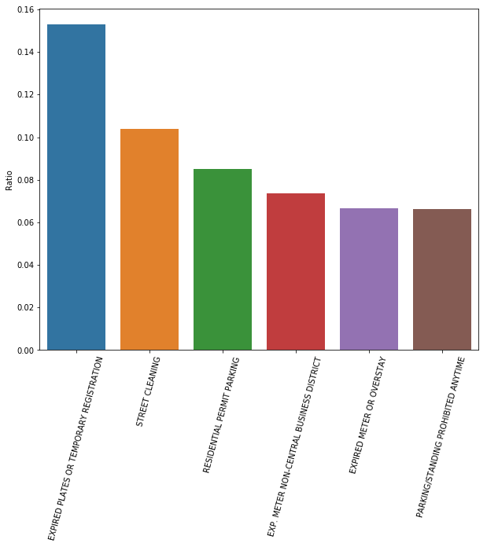
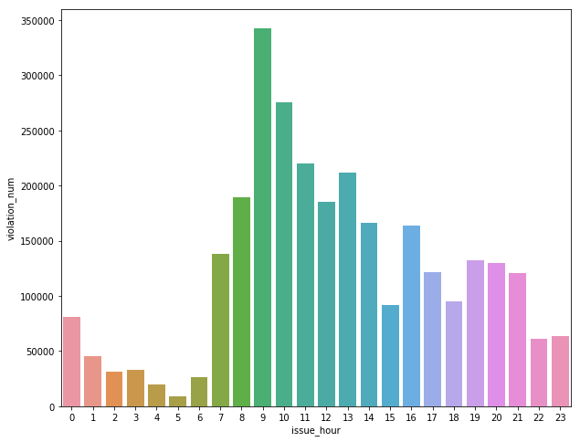

# TDI Project (1st & 2nd plot)


```python
#import Libraries
import numpy as np
import pandas as pd
from datetime import datetime
import seaborn as sns
import matplotlib.pyplot as plt
%matplotlib inline
import warnings
warnings.filterwarnings('ignore')
```

### The dataset is about 8G, too large to read in the entire csv file. I chose to grab only the columns needed for specific questions. The first question I'd like to find out is the most common violation types.  In this case, only the column 'violation\_description' is needed.


```python
#take a look at the head in the data file
pd.read_csv('data/processed/parking_tickets.csv', index_col=0, nrows = 3)
```


<div>
<style scoped>
    .dataframe tbody tr th:only-of-type {
        vertical-align: middle;
    }

    .dataframe tbody tr th {
        vertical-align: top;
    }

    .dataframe thead th {
        text-align: right;
    }
</style>
<table border="1" class="dataframe">
  <thead>
    <tr style="text-align: right;">
      <th></th>
      <th>issue_date</th>
      <th>violation_location</th>
      <th>license_plate_number</th>
      <th>license_plate_state</th>
      <th>license_plate_type</th>
      <th>zipcode</th>
      <th>violation_code</th>
      <th>violation_description</th>
      <th>unit</th>
      <th>unit_description</th>
      <th>...</th>
      <th>fine_level2_amount</th>
      <th>current_amount_due</th>
      <th>total_payments</th>
      <th>ticket_queue</th>
      <th>ticket_queue_date</th>
      <th>notice_level</th>
      <th>hearing_disposition</th>
      <th>notice_number</th>
      <th>officer</th>
      <th>address</th>
    </tr>
    <tr>
      <th>ticket_number</th>
      <th></th>
      <th></th>
      <th></th>
      <th></th>
      <th></th>
      <th></th>
      <th></th>
      <th></th>
      <th></th>
      <th></th>
      <th></th>
      <th></th>
      <th></th>
      <th></th>
      <th></th>
      <th></th>
      <th></th>
      <th></th>
      <th></th>
      <th></th>
      <th></th>
    </tr>
  </thead>
  <tbody>
    <tr>
      <th>51551278</th>
      <td>2007-01-01 00:00:00</td>
      <td>6014 W 64TH ST</td>
      <td>90ad622c3274c9bdc9d8c812b79a01d0aaf7479f2bd743...</td>
      <td>IL</td>
      <td>PAS</td>
      <td>60638</td>
      <td>0976160F</td>
      <td>EXPIRED PLATES OR TEMPORARY REGISTRATION</td>
      <td>8</td>
      <td>CPD</td>
      <td>...</td>
      <td>100</td>
      <td>0</td>
      <td>100</td>
      <td>Paid</td>
      <td>2007-05-21 00:00:00</td>
      <td>SEIZ</td>
      <td>NaN</td>
      <td>5048648030</td>
      <td>15227</td>
      <td>6000 w 64th st, chicago, il</td>
    </tr>
    <tr>
      <th>51491256</th>
      <td>2007-01-01 00:00:00</td>
      <td>530 N MICHIGAN</td>
      <td>bce4dc26b2c96965380cb2b838cdbb95632b7b57160612...</td>
      <td>IL</td>
      <td>PAS</td>
      <td>606343801</td>
      <td>0964150B</td>
      <td>PARKING/STANDING PROHIBITED ANYTIME</td>
      <td>18</td>
      <td>CPD</td>
      <td>...</td>
      <td>100</td>
      <td>50</td>
      <td>0</td>
      <td>Define</td>
      <td>2007-01-22 00:00:00</td>
      <td>NaN</td>
      <td>NaN</td>
      <td>0</td>
      <td>18320</td>
      <td>500 n michigan, chicago, il</td>
    </tr>
    <tr>
      <th>50433524</th>
      <td>2007-01-01 00:01:00</td>
      <td>4001 N LONG</td>
      <td>44641e828f4d894c883c07c566063c2d99d08f2c03b3d4...</td>
      <td>IL</td>
      <td>PAS</td>
      <td>60148</td>
      <td>0976160F</td>
      <td>EXPIRED PLATES OR TEMPORARY REGISTRATION</td>
      <td>16</td>
      <td>CPD</td>
      <td>...</td>
      <td>100</td>
      <td>0</td>
      <td>50</td>
      <td>Paid</td>
      <td>2007-01-31 00:00:00</td>
      <td>VIOL</td>
      <td>NaN</td>
      <td>5079875240</td>
      <td>3207</td>
      <td>4000 n long, chicago, il</td>
    </tr>
  </tbody>
</table>
<p>3 rows × 22 columns</p>
</div>


```python
#read in data needed
violation_desc = pd.read_csv('data/processed/parking_tickets.csv', usecols = ['violation_description'])
total_count = len(violation_desc)
violation_valuecount = violation_desc['violation_description'].value_counts()
#plot the ratio of the top 6 violation types
plt.figure(figsize = (10,8))
ax = sns.barplot(violation_valuecount.head(6).index,violation_valuecount.head(6).values/total_count)
ax.set_xticklabels(ax.get_xticklabels(),rotation=75)
ax.set(ylabel='Ratio')
```


    [Text(0, 0.5, 'Ratio')]





### It turns out that EXPIRED PLATES OR TEMPORARY REGISTRATION is the most common violation type. Procrastination is everywhere. Following five types are STREET CLEANING, RESIDENTIAL PERMIT PARKING, EXP. METER NON-CENTRAL BUSINESS DISTRICT, EXPIRED METER OR OVERSTAY and PARKING/STANDING PROHIBITED ANYTIME.


### The second question: what is the time during a day most of the tickets issued? To answer this question, two columns are needed: 'issue\_date' and 'violation\_description'


```python
violation_issuedate_vs_type = pd.read_csv('data/processed/parking_tickets.csv', usecols = ['issue_date','violation_description'])
```

### When I apply a method to the 'issue\_date' column and try to extract 'HOUR' of the time, it seems the cropped dataset 'violation\_issuedate\_vs\_type' is still a bit large. I decide to use dataset since 2017 to perform the analysis as a starting point. Things will be improved in the future.


```python
#Grab the data since 2017
index_start = violation_issuedate_vs_type.index[violation_issuedate_vs_type['issue_date'] == '2017-01-01 00:00:00'][0]
index_end = len(violation_issuedate_vs_type)
violation_issuedate_vs_type_since2017 = violation_issuedate_vs_type.iloc[index_start:index_end,:]
#Grab HOUR from issue_date
violation_issuedate_vs_type_since2017['issue_date'] = violation_issuedate_vs_type_since2017['issue_date'].apply(lambda x: datetime.strptime(x, '%Y-%m-%d %H:%M:%S').hour).values
violation_issuedate_vs_type_since2017.rename(columns={'issue_date':'issue_hour'},inplace=True)
violation_hour = pd.DataFrame({'violation_num' : violation_issuedate_vs_type_since2017.groupby( ["issue_hour"] ).size()}).reset_index()
plt.figure(figsize = (10,8))
sns.barplot('issue_hour','violation_num',data=violation_hour)
```


    <matplotlib.axes._subplots.AxesSubplot at 0x11ded78d0>





### Take care of your car in the morning, especially 9-10am. 

### Above is just a brief demonstration. There are much much more useful information as well as intereting phonomena that we can explore.  A few examples would be: How does it compare for vehicles that have Illinois license plate vs others? What are the revenue and debt trend? What are the regions that most tickets issued at?  etc...
